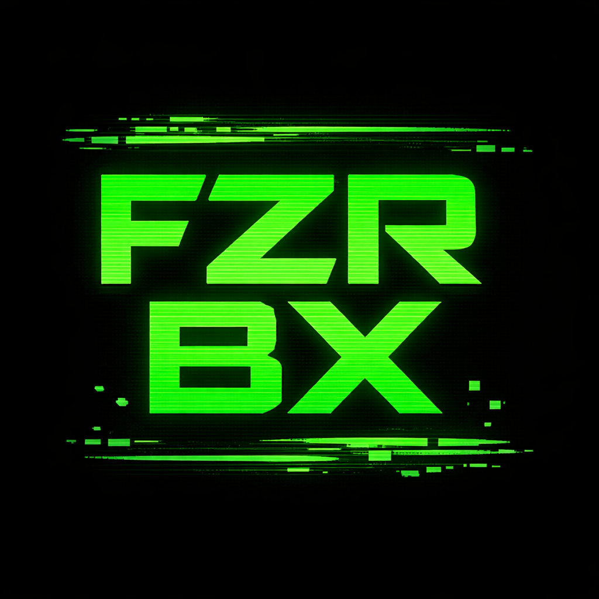
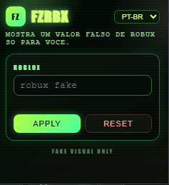

# FZRBX 💸

**Extension de visualizacion falsa de Robux (100% Open Source)**  
Extension totalmente open source creada solo para fines visuales, educativos y recreativos.  
No genera Robux reales, no modifica datos del servidor y no afecta cuentas de Roblox.  
Funciona solo en el navegador, cambiando lo que se muestra en pantalla.



---

## 🌍 Idiomas

- 🇧🇷 Português [CLIQUE AQUI](README.md)
- 🇺🇸 English [CLICK HERE](README.en.md)
- 🇪🇸 Espanol (este archivo)

---

## 🔓 Proyecto 100% Open Source

- Todo el codigo es publico.
- No hay codigo oculto.
- No se recopilan datos.
- No existe comunicacion externa.

---

## 🚀 Que hace esta extension

- Muestra una cantidad falsa de Robux.
- Mantiene el valor fijo al recargar la pagina.
- Funciona solo en el front-end.
- Selector de idioma en el popup (PT-BR, EN, ES).
- Ideal para:
  - bromas;
  - grabar videos;
  - streaming y compartir pantalla;
  - pruebas visuales.

---

## ❌ Que NO hace

- No genera Robux.
- No cambia el saldo real.
- No envia datos a servidores de Roblox.
- No elude sistemas de seguridad.
- No funciona fuera del navegador.

---

## 🧠 Como funciona

1. El valor falso se guarda localmente en el navegador.
2. Un script se ejecuta en las paginas de Roblox.
3. El texto mostrado se reemplaza visualmente.
4. El valor permanece fijo.

Es basicamente el mismo efecto de usar **Inspeccionar elemento**, pero automatico.

---

## 🧩 Interfaz de la extension

- Campo para ingresar el valor falso.
- Boton **Apply** (aplica y guarda localmente).
- Boton **Reset** (elimina el valor guardado).
- Mensajes de estado en el popup.

---

## 📸 Screenshot



---

## 🌐 Navegadores compatibles

Funciona en navegadores basados en Chromium:
- Google Chrome
- Microsoft Edge
- Brave
- Opera
- Vivaldi

---

## 🛠️ Instalacion (Modo desarrollador)

Abrir la pagina de extensiones:

```
chrome://extensions
```

Luego:

1. Activar **Modo desarrollador**.
2. Hacer clic en **Cargar sin empaquetar**.
3. Seleccionar la carpeta del proyecto.

---

## 💎 Apoya el proyecto

Si quieres ayudar:

- 💚 PIX: pixgg.com/foltz
- 🟠 Bitcoin (BTC): bc1qn9nuvkqz29pzfzndj0vr6s32qd72jazh5gup40
- 🔷 Ethereum (ETH): 0x8Cc50279b5370442C46cC52152eFa50A5f300447

---

## ⚠️ Aviso legal

- No afiliado a Roblox.
- No modifica datos reales.
- Uso solo visual y educativo.
