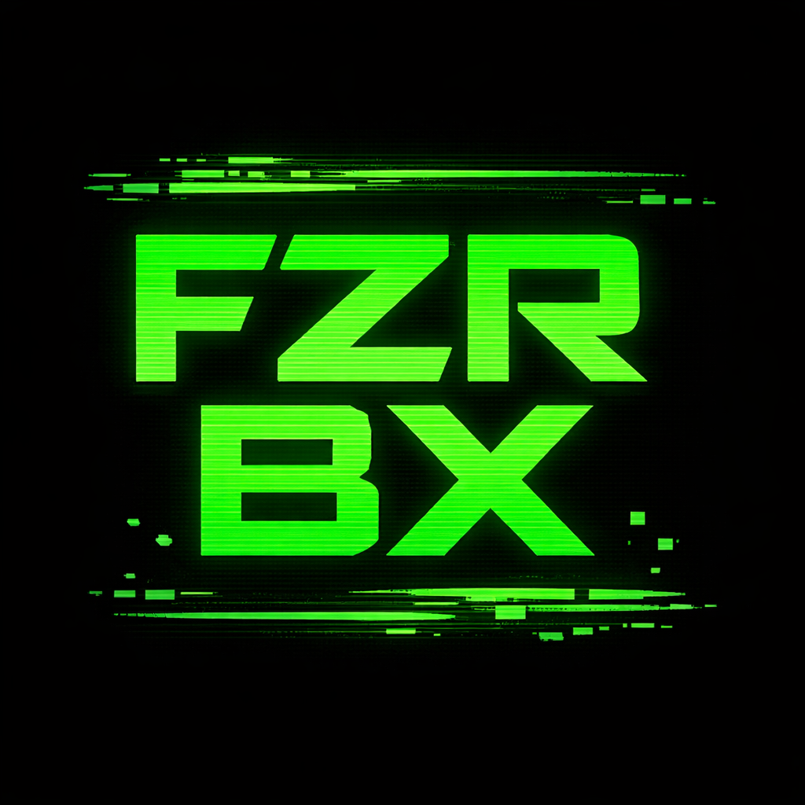
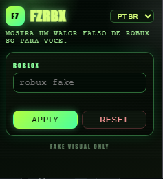

# FZRBX 💸

  

**Fake Robux Display Extension (100% Open Source)**  
Extensão totalmente open source criada apenas para fins visuais, educacionais e de entretenimento.  
Não gera Robux reais, não altera dados do servidor e não interfere na conta do Roblox.  
Funciona apenas no navegador, modificando o que é exibido na tela.



---

## Idiomas

- 🇧🇷 Português (este arquivo)
- 🇺🇸 English [CLICK HERE](README.md)
- 🇪🇸 Español [HAZ CLIC AQUÍ](README.es.md)

---

## Projeto 100% Open Source

- Todo o código é público.
- Não há código oculto ou ofuscado.
- Não há coleta de dados.
- Não existe comunicação externa.

---

## O que essa extensão faz

- Exibe um valor fake de Robux.
- Mantém o valor fixo ao recarregar a página.
- Funciona somente no front-end.
- Seletor de idioma no popup (PT-BR, EN, ES).
- Ideal para:
  - trollar amigos;
  - gravar vídeos;
  - streaming (OBS, Discord, lives);
  - compartilhar tela sem mostrar o saldo real;
  - testes visuais.

---

## O que ela NÃO faz

- Não gera Robux.
- Não altera saldo real.
- Não envia dados para servidores do Roblox.
- Não burla compras ou segurança.
- Não funciona fora do navegador.

---

## Como funciona

1. O valor fake é salvo localmente no navegador.
2. Um script roda nas páginas do Roblox.
3. O texto exibido é substituído por um valor fake.
4. O valor continua fixo mesmo após atualizações da página.

É basicamente o mesmo efeito de usar **Inspecionar Elemento**, só que automático.

---

## Interface da extensão

- Campo para inserir o valor fake.
- Botão **Apply** (aplica o valor e salva localmente).
- Botão **Reset** (remove o valor salvo).
- Mensagens de status no popup.

---

## Screenshot



---

## Navegadores compatíveis

Funciona em qualquer navegador baseado em Chromium:
- Google Chrome
- Microsoft Edge
- Brave
- Opera
- Vivaldi

---

## Instalação (Modo Desenvolvedor)

Abra a página de extensões do navegador:

```
chrome://extensions
```

Depois:

1. Ative o **Modo do desenvolvedor**.
2. Clique em **Carregar sem compactação**.
3. Selecione a pasta do projeto.

---

## Aviso legal

- Projeto não afiliado ao Roblox.
- Não modifica dados reais.
- Uso apenas visual, educacional ou recreativo.
